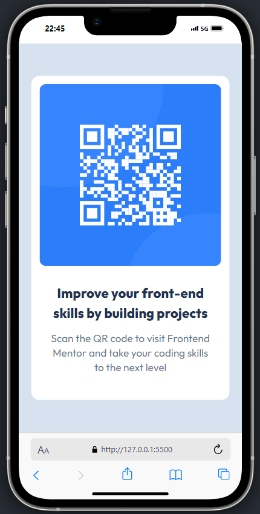

# Frontend Mentor - QR code component solution

This is a solution to the [QR code component challenge on Frontend Mentor](https://www.frontendmentor.io/challenges/qr-code-component-iux_sIO_H). Frontend Mentor challenges help you improve your coding skills by building realistic projects.

## Table of contents

- [Overview](#overview)
  - [Screenshot](#screenshot)
  - [Links](#links)
- [My process](#my-process)
  - [Built with](#built-with)
  - [What I learned](#what-i-learned)
  - [Continued development](#continued-development)
  - [Useful resources](#useful-resources)
- [Author](#author)
- [Acknowledgments](#acknowledgments)

## Overview

This is a simple QR code component built using HTML and Tailwind CSS. This one is my first Frontend Mentor challenge and it took me around 30 minutes to complete. I tried to follow best practices for building a component like this. The design is responsive and works well on different screen sizes.

### Screenshot

## My process

- Initialise the project using GitHub Desktop App
- Creating the basic HTML file
- Installing Tailwindcss with some custom config
- Coding like a puppy!

### Built with

- Semantic HTML5 markup
- CSS custom properties
- [Tailwind CSS](https://tailwindcss.com/) - Utility-first CSS framework

### What I learned

I gained experience with installing and configuring Tailwind CSS in a project, including how to use its class style utility and customize its configuration options.

## Author

- Frontend Mentor - [@NickyRak](https://www.frontendmentor.io/profile/NickyRak)
- LinkedIn - [@nicky-rakotoarimanana](https://www.linkedin.com/in/nicky-rakotoarimanana-488025262/)
- Instagram - [@ykcin_r](https://www.instagram.com/ykcin_r)
